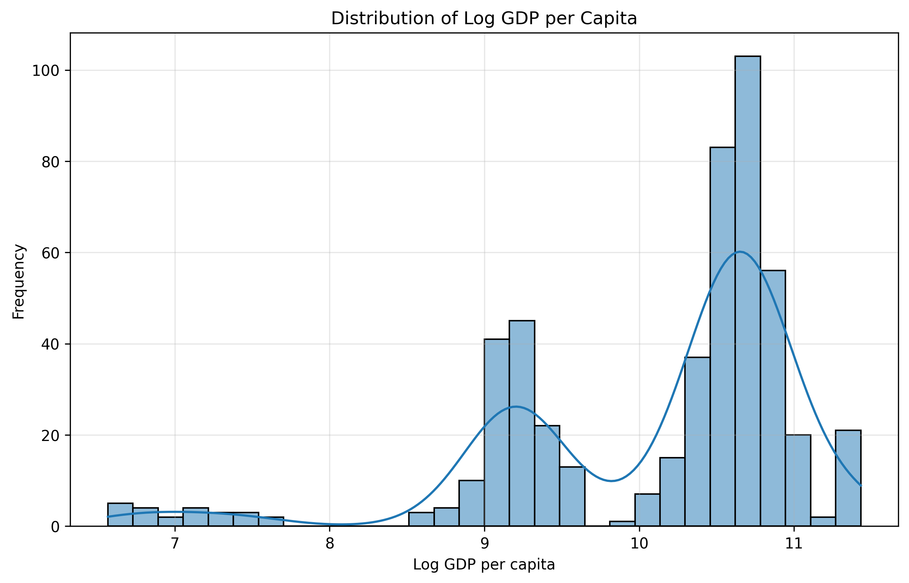
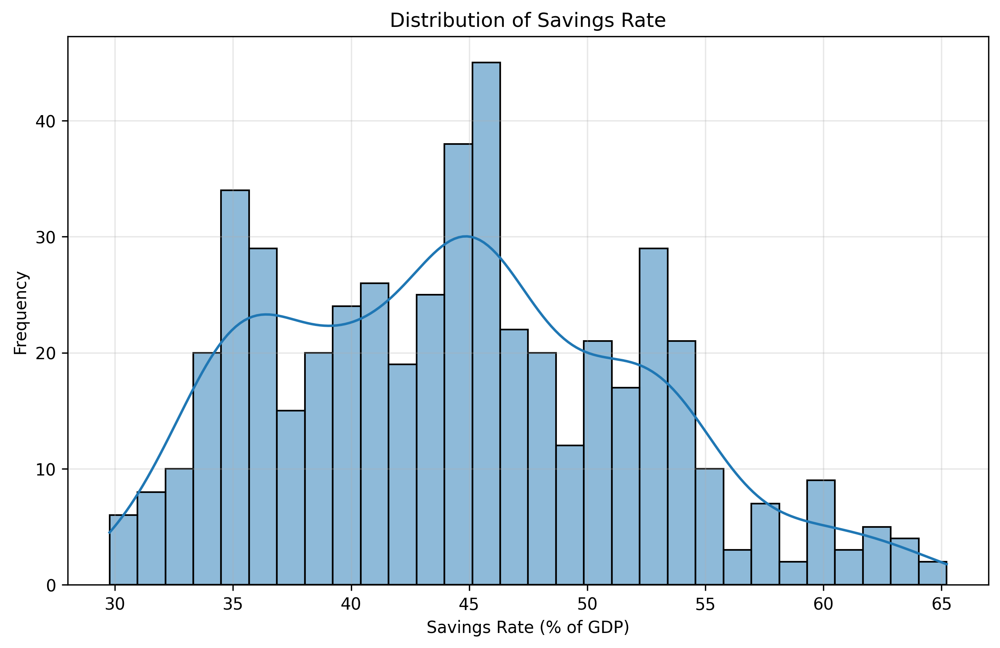
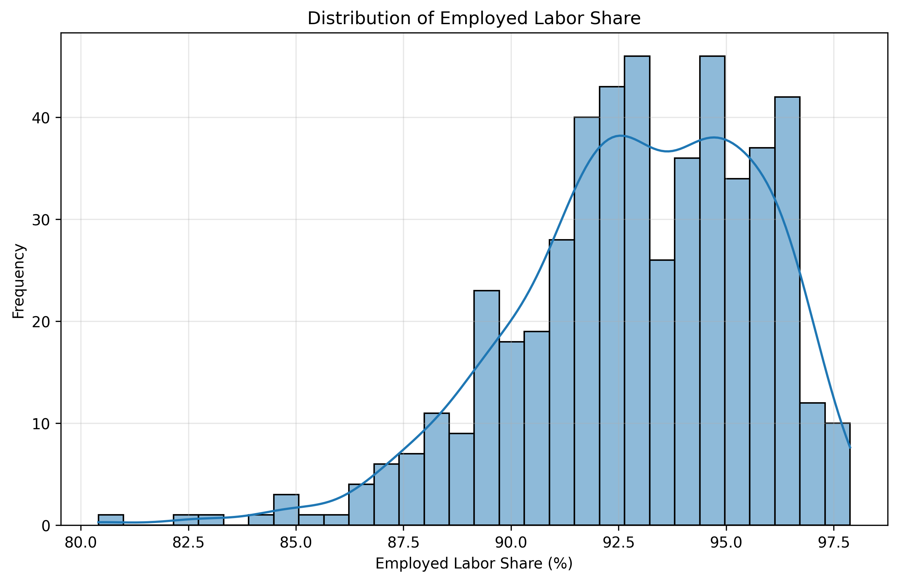
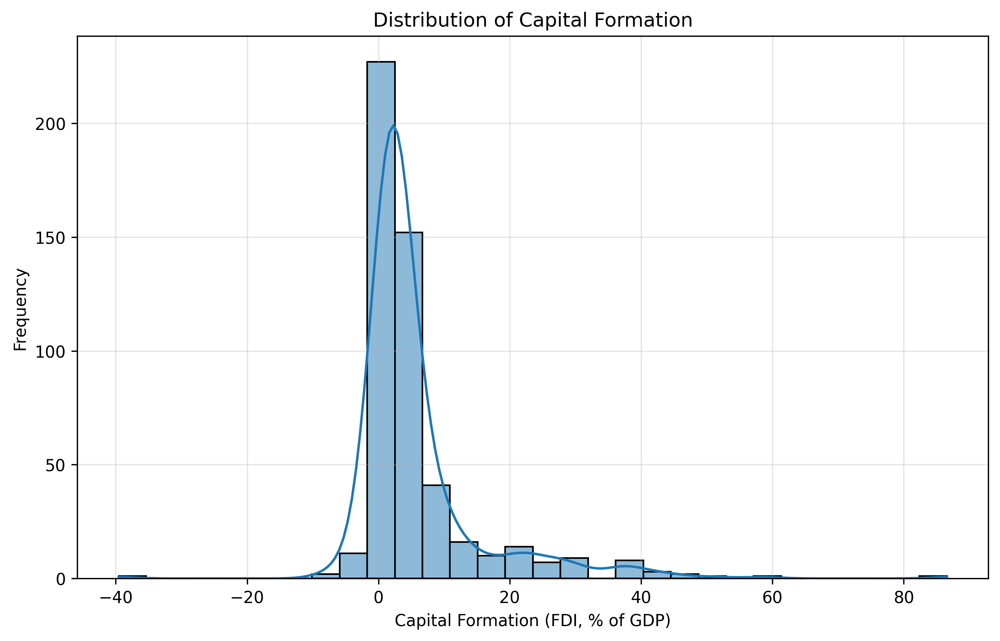

# Econometrics Project: Country Output Modeling

This document presents **Part 3: Country Output Modeling**. The analysis uses a modified Cobb-Douglas production function to model GDP per capita using panel data of 22 countries from 1996 to 2018.

## Data Overview

- **Countries:** 22
- **Years:** 1996 - 2018 (balanced panel after processing)
- **Observations:** 506
- **Target variable:** log GDP per capita (constant 2010 USD)

---

## Stage 1. Data Preparation

### 1.1 New Variables

| Variable | Formula | Description |
|----------|---------|-------------|
| GDP per capita | gdp_const2010 × 1e9 / population | GDP per person in constant USD |
| Savings rate | 100 − hh_cons | Gross savings as % of GDP |
| Employed labor share | 100 − unemp | Employment rate as % of labor force |
| Capital formation | fdi | Foreign direct investment as % of GDP (proxy) |

**Note:** The dataset does not contain gross capital formation (`cap`) as specified in the task. FDI is used as a proxy for capital formation. This is a limitation, as FDI typically represents a smaller fraction of total capital formation.

### 1.2 Missing Data Treatment

Missing values were handled using forward fill within countries, with linear interpolation for population. After processing, 506 observations remained (originally 638). The final sample covers 1996-2018 (balanced panel).

### 1.3 Model Specifications

Three panel models were estimated:

- **Pooled OLS:** Ignores panel structure (assumes no country-specific effects)
- **Fixed Effects (FE):** Accounts for country-specific intercepts (allows correlation with regressors)
- **Random Effects (RE):** Assumes country-specific effects are uncorrelated with regressors; estimated via feasible generalized least squares (FGLS) with quasi-demeaning transformation

---

## Stage 2. Exploratory Data Analysis

### 2.1 Summary Statistics

| Variable | Mean | Std Dev | Min | Max |
|----------|------|---------|-----|-----|
| Log GDP per capita | 10.11 | 0.97 | 6.57 | 11.43 |
| Savings rate (%) | 44.5 | 7.7 | 29.8 | 65.2 |
| Capital formation (FDI, %) | 5.85 | 9.87 | -39.55 | 86.59 |
| Employed labor share (%) | 92.9 | 2.8 | 80.4 | 97.9 |
| Education spending (% GDP) | 4.90 | 1.47 | 0.00 | 8.56 |
| Market capitalization (% GDP) | 103.55 | 167.44 | 6.27 | 1274.90 |
| Value added — industry (% GDP) | 25.3 | 6.0 | 6.5 | 41.1 |
| Value added — services (% GDP) | 62.1 | 8.9 | 37.7 | 91.9 |

### 2.2 Distribution Plots

---

## Stage 3. Model Results

### 3.1 Model Comparison

| Variable | Pooled OLS | Fixed Effects | Random Effects |
|----------|------------|---------------|----------------|
| Intercept | 0.7232 | 3.2582 | 0.1410 |
| Savings rate | 0.0439*** | 0.0308*** | 0.0314*** |
| Capital formation (FDI) | 0.0013 | 0.0013** | 0.0013** |
| Employed labor share | -0.0241** | 0.0331*** | 0.0332*** |
| Education spending | 0.2406*** | 0.0221** | 0.0250** |
| Market capitalization | -0.0008*** | 0.0004*** | 0.0004*** |
| Value added — industry | 0.0736*** | -0.0002 | 0.0011 |
| Value added — services | 0.1082*** | 0.0320*** | 0.0332*** |

*Note: *** p < 0.01, ** p < 0.05*

### 3.2 Model Selection Tests

| Test | Statistic | p-value | Conclusion |
|------|-----------|---------|------------|
| F-test (FE vs Pooled) | 617.33 | 0.0000 | Fixed effects are significant |
| Breusch-Pagan LM (RE vs Pooled) | 2682.28 | 0.0000 | Random effects are significant |
| Hausman test (FE vs RE) | 5.92 | 0.6560 | Random Effects is preferred |

**Conclusion:** Based on the Hausman test (p > 0.05), the **Random Effects model** is selected as the preferred specification.

### 3.3 Economic Interpretation (Random Effects)

| Variable | Coefficient | Interpretation |
|----------|-------------|----------------|
| Savings rate | 0.0314 | +1 percentage point → 3.1% increase in GDP per capita |
| Capital formation (FDI) | 0.0013 | +1 p.p. FDI → 0.13% increase in GDP per capita |
| Employed labor share | 0.0332 | +1 p.p. employment → 3.3% increase in GDP per capita |
| Education spending | 0.0250 | +1 p.p. education → 2.5% increase in GDP per capita |
| Market capitalization | 0.0004 | +1 p.p. market cap → 0.04% increase in GDP per capita |
| Value added — services | 0.0332 | +1 p.p. services share → 3.3% increase in GDP per capita |
| Value added — industry | 0.0011 | Not statistically significant |

**Economic consistency:** All significant coefficients have the expected positive sign — higher savings, employment, education, and services sector share are associated with higher GDP per capita, consistent with growth theory.

**Key findings:**
- Savings rate and employment share have the strongest positive effects on GDP per capita
- Education spending and FDI also contribute positively
- The services sector is a significant driver of growth, while industry is not
- Market capitalization has a small but statistically significant positive effect

## Stage 4. Crisis Effects

Crisis dummies were added to the preferred Random Effects model:

| Variable | Coefficient | p-value |
|----------|-------------|---------|
| Crisis 1998 | -0.0279 | 0.1822 |
| Crisis 2008-2009 | -0.0110 | 0.4550 |

**Conclusion:** Neither crisis dummy is statistically significant at conventional levels. This suggests that in this sample of primarily industrial/post-industrial countries, the 1998 financial crisis and the 2008-2009 global financial crisis did not have a detectable impact on GDP per capita after controlling for other factors.

---

## Conclusion

### Key Findings

1. **Random Effects model** is preferred (Hausman test p = 0.656)
2. **Savings rate** and **employment share** have the largest positive impact on GDP per capita
3. **Education spending** and **FDI** are significant but have smaller effects
4. **Services sector** drives growth; industry sector is not significant
5. **Crisis dummies** (1998, 2008-2009) are not statistically significant

### Limitations

- FDI used as proxy for capital formation due to data limitations
- Missing data in early years (1990-1995) excluded from analysis
- Relatively small sample (22 countries)

### Future Research

- Include additional control variables (e.g., institutional quality, trade openness)
- Test for non-linear relationships (e.g., diminishing returns to savings)
- Extend the sample to include developing countries
- Use alternative measures of capital formation (gross fixed capital formation if available)

